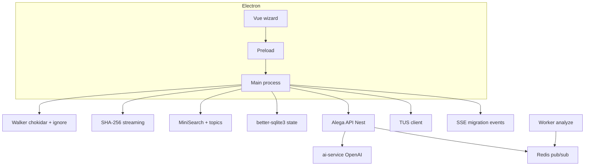

# Blueprint — `alega-desktop` (wizard de migración)

Proyecto autónomo recomendado: **Electron** + **Vue 3** + **PrimeVue** + TypeScript. Repo hermano del monorepo web, p. ej. `alega/alega-desktop/` junto a `alega/friendly-succotash/`.

## Objetivos

- Wizard paso a paso: conexión (OAuth Google con `alega-desktop://`), carpeta local, escaneo incremental, perfil + índice invertido local, sugerencias servidor, chat IA (vía API), commit del plan, subida TUS con SSE de progreso real.
- Perfilado local antes de IA: extracción acotada de texto (PDF, DOCX, XLSX, plano) + **MiniSearch** (BM25) y términos por carpeta; al servidor solo estadísticas y **muestras** (snippets).
- Autenticación “un clic” con navegador del sistema y deep-link.

## Arquitectura



## Integración API

- Contrato: [`desktop-agent-contract.md`](./desktop-agent-contract.md)
- Endpoints wizard: `/api/migration/*`
- Import/TUS: `/api/import/*` (sin cambios de protocolo)

## Estructura de repo sugerida

```
alega-desktop/
  electron.vite.config.ts
  electron-builder.yml
  package.json
  src/
    main/
      index.ts          # ventana, protocolo alega-desktop://, IPC
      auth.ts           # openExternal google + state=desktop
      ipc.ts
      fs/walker.ts
      fs/hasher.ts
      fs/extractor.ts
      index/invertedIndex.ts
      index/topics.ts
      net/apiClient.ts
      net/tusUpload.ts
      net/sseClient.ts
      storage/state.ts
    preload/index.ts
    renderer/
      index.html
      src/
        main.ts App.vue router.ts
        views/wizard/Step1Connect.vue … Step6Upload.vue
        components/FolderMap.vue TopicCloud.vue AiChatPanel.vue LiveStatus.vue
        composables/useDesktop.ts useAuth.ts useBatch.ts
```

Dependencias clave: `electron`, `electron-vite`, `vue`, `primevue`, `pinia`, `vue-router`, `axios`, `chokidar`, `ignore`, `p-queue`, `pdf-parse`, `mammoth`, `xlsx`, `minisearch`, `tus-js-client`, `eventsource`, `better-sqlite3`, `@tracker/shared` (path `file:../friendly-succotash/packages/shared`).

## Protocolo personalizado

- Producción: registrar `alega-desktop` con **electron-builder** (`protocols` en `electron-builder.yml`).
- Desarrollo (Linux): puede requerir un `.desktop` o `xdg-mime` manual; documentar en README del cliente.

## Plataformas

- Windows x64, Linux x64, macOS aarch64/x64.
- `better-sqlite3` y módulos nativos: tras `pnpm install`, ejecutar rebuild para la versión de Electron usada (`electron-builder install-app-deps` o `pnpm exec electron-rebuild`).

## Seguridad

- No loguear tokens completos ni `uploadToken`.
- Snippets al servidor acotados; binarios completos solo tras confirmación y TUS.
- Refresh token en URL de deep-link: minimizar tiempo de exposición y usar solo sobre HTTPS / entorno controlado.

## Referencia heredada

El antiguo prototipo Rust/Tauri (`alega-desktop-migrator`) fue **reemplazado** por este stack Electron; conservar solo la lógica de negocio relevante (TUS, hashing) portada a TypeScript en `src/main/`.
