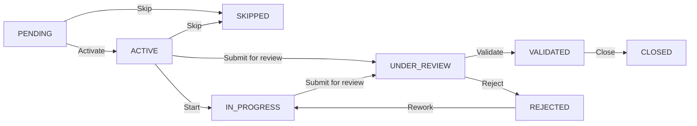

# Flujos configurables (Jira-style) — paso a paso

Guía operativa + de arquitectura del nuevo sistema de workflows configurables
por organización y por `ActionType`. Describe qué se instaló, cómo se resuelve
el flujo de una actividad, cómo se muestra en Kanban y cómo convivir con el
motor legacy hasta su retiro.

---

## 1. Modelo de datos

Tablas y columnas clave (migraciones `22_WorkflowDefinitions`, `23`, `24`, `25`):

- `workflow_definitions` — flujo reutilizable
  - `slug` (único por sistema)
  - `is_system` / `organization_id` — del sistema vs. personalizado por org
  - `action_type` (nullable) — si el flujo es específico de un `ActionType`
  - `applies_to_all_types` — flujo genérico multimateria
  - `is_default` — marcado como default del sistema
- `workflow_states`
  - `workflow_id`, `key` (= `WorkflowItemStatus`), `name`, `category`
    (= `WorkflowStateCategory`: `TODO | IN_PROGRESS | IN_REVIEW | DONE | CANCELLED`)
  - `is_initial`, `sort_order`
- `workflow_transitions`
  - `from_state_id` → `to_state_id`, `name`, `required_permission`
- `workflow_items`
  - `workflow_id` + `current_state_id` (fuente de verdad del estado; sin columna `status`)
  - `item_number` — ticket `PREFIX-N` por trackable (Jira-style)
  - `action_type` (nullable)
- `workflow_template_items`
  - `workflow_id`, `current_state_id`, `action_type`
- `organizations`
  - `feature_flags.useConfigurableWorkflows: boolean`
  - `workflow_action_type_defaults: Record<ActionType, workflowId>`
    — override por org por `ActionType`

Ver `packages/db/src/entities/organization.entity.ts` líneas 16-41.

---

## 2. Seeds del sistema

Script: `packages/db/src/seeds/workflows.seed.ts`.

Crea de forma **idempotente** los workflows del sistema:

1. `standard-judicial-pe` — default judicial (materias litigiosas).
2. `standard-office` — default despacho (no litigioso).
3. Uno por cada `ActionType` con slug `action-{actionType}-default`
   (ej. `action-doc_upload-default`, `action-approval-default`, …).

Todos comparten 8 estados estándar (`STANDARD_STATES`) y 10 transiciones
estándar (`STANDARD_TRANSITIONS`), alineados con la máquina de estados legacy
`WorkflowItemStateMachine` de `@tracker/shared`.

4. **`demo-free` (Demo libre)** — mismo conjunto de 8 estados, pero con
   transición entre **cualquier par de estados distintos** y sin
   `required_permission` (solo para pruebas; ver walkthroughs abajo).

Comando:

```bash
pnpm --filter @tracker/db seed:workflows
```

---

## 3. Backfill / migración de datos

Script: `packages/db/src/seeds/migrate-data-workflows.ts`.

Asigna `workflow_id` + `current_state_id` a **ítems hoja** que aún no tienen
flujo (tanto `workflow_items` reales como `workflow_template_items`).

Regla de slug por hoja (`slugForLeafItem`):

1. Si el ítem tiene `actionType` → `systemWorkflowSlugForActionType(actionType)`
   (= `action-{actionType}-default`).
2. Si no → `matterFallbackWorkflowSlug(matterType)` (judicial / office).

Notas de implementación:

- Corre **fuera de request/JWT**, así que todas las queries sobre entidades
  multitenant usan `{ filters: false }` para evitar el error
  `No arguments provided for filter 'tenant'`.
- Es **idempotente**: si el ítem ya tiene `workflow` y `currentState`, lo salta.
- Si es un ítem padre (tiene hijos), lo ignora — solo hojas ejecutan flujo.

Comando:

```bash
pnpm --filter @tracker/db migrate:data:workflows
```

Salida esperada:

```text
migrate-data-workflows: updated N workflow_items (leaves), M workflow_template_items (leaves).
```

---

## 4. Resolución del flujo de una actividad

`apps/api/src/modules/workflow/workflow-assignment.service.ts` →
`resolveLeafWorkflow()`.

Orden de prioridad (primero que exista gana):

1. **`templateWorkflowId`** — la plantilla estructural
   (`WorkflowTemplateItem.workflow`) fija el flujo.
2. **`explicitWorkflowId`** — override pasado en DTO al crear la actividad o en
   cambio manual desde UI.
3. **`org.workflowActionTypeDefaults[actionType]`** — default propio de la
   organización para ese `ActionType`.
4. **Sistema por `ActionType`** — `slug = action-{actionType}-default`.
5. **Fallback por materia** — `standard-judicial-pe` o `standard-office`
   según `MatterType`.

Cuando se asigna:

- Se verifica que la organización pueda usar ese workflow
  (`assertOrgCanUseWorkflow`) — bloquea usar workflows de otra org.
- Se busca el estado inicial con `findInitialState` (prioriza `isInitial=true`,
  cae en `key = PENDING`).
- El caller instancia/actualiza la actividad con `{ workflow, currentState }`
  y `status = currentState.key`.

Método relacionado: `applyWorkflowToLeafItem(itemId, workflowId, orgId)` —
cambia el flujo de una actividad hoja y la reinicia en el estado inicial del
nuevo workflow.

---

## 5. Motor configurable (Fase 3 — sin legacy en API)

`WorkflowService.transitionWorkflowItem` solo usa
`WorkflowEngineService.applyTransition` (transiciones definidas en
`workflow_transitions`). Si `shouldUseConfigurableEngine` es falso, responde
**400** con un mensaje que indica activar el flag y completar datos.

Condiciones (`WorkflowEngineService.shouldUseConfigurableEngine`):

- `organization.featureFlags.useConfigurableWorkflows === true`, **y**
- `workflow_id` y `current_state_id` presentes (hojas y padres).

La columna **`workflow_items.status` fue eliminada** (`Migration_26`); el
estado actual es siempre `workflow_states.key` vía `current_state_id`. En JSON
de API, `status` y `stateKey` reflejan ese mismo valor (compatibilidad).

---

## 6. Kanban unificado por `WorkflowStateCategory`

La UI Kanban agrupa por **categoría** (`TODO | IN_PROGRESS | IN_REVIEW |
DONE | CANCELLED`). La categoría sale de `WorkflowState.category` o, en
cliente, de `legacyWorkflowCategoryForStatus(stateKey)` como respaldo.

API para drag & drop en Kanban:

```http
GET /workflow-items/:id/category-transitions?category=in_progress
```

(`category` debe ser un valor de `WorkflowStateCategory`: `todo`, `in_progress`,
`in_review`, `done`, `cancelled`.)

Devuelve transiciones cuyo estado destino cae en la categoría, vía
`workflowEngine.getTransitionsToCategory` (motor configurable obligatorio).

Ver `apps/api/src/modules/workflow-items/workflow-items.controller.ts` y
`workflow.service.ts`.

Listado de transiciones posibles desde el estado actual (filtrado por permisos del usuario):

```http
GET /workflow-items/:id/transitions
```

Modo avanzado (columnas por estado en Kanban): el cliente usa el mismo
`GET /workflow-items/:id/transitions` y toma `to` como clave de columna cuando
el layout es “por estados”.

---

## 7. ECA parametrizadas por workflow del ítem

Las reglas ECA usan `item.currentStateKey` (y `item.status` en contexto como
alias del mismo valor) para condiciones; las transiciones automáticas pasan
por `WorkflowEngineService` con el `workflow_id` del ítem.

---

## 8. UI: editor de workflows + roles

- **Settings → Flujos** — lista workflows del sistema y los personalizados de la
  org; duplicar desde sistema (`POST /workflow-definitions/duplicate`), duplicar
  un flujo propio (`POST /workflow-definitions/:id/duplicate`), eliminar flujo
  org sin uso (`DELETE /workflow-definitions/:id`).
- **Editor de flujo org** (`WorkflowEditView`) — pestañas: Metadatos (nombre,
  `actionType`, `appliesToAllTypes`), **Estados** (CRUD vía API), **Transiciones**
  (CRUD; permiso opcional por transición), **Previsualización** (grafo con
  Vue Flow), **Permisos (resumen)**.
- **API CRUD** (solo workflows de la org, no sistema):
  - `POST/PATCH/DELETE /workflow-definitions/:id/states` (+ `/:stateId`)
  - `POST/PATCH/DELETE /workflow-definitions/:id/transitions` (+ `/:transitionId`)
- **Gestión de roles** — enlace a Ajustes → Roles; los códigos de permiso en
  transiciones son strings (p. ej. `workflow:review`).
- **Defaults por `ActionType`** — desde Settings de organización se edita
  `workflowActionTypeDefaults` (ver `organizations.controller.ts` →
  `PATCH /organizations/me`).

## 8b. Diagnóstico CLI

```bash
pnpm --filter @tracker/db diagnose:workflows -- --org <uuid-org | email-usuario>
```

Sin `--org` usa la primera organización por nombre. Imprime flag, defaults,
workflows sistema/org, hojas sin `workflow_id`/`current_state_id`, y matriz de
transiciones por workflow.

---

## 9. Comandos en orden (deploy + backfill)

```bash
# 1. schema (incluye Migration_26: DROP workflow_items.status)
pnpm db:migrate

# 2. workflows del sistema
pnpm --filter @tracker/db seed:workflows

# 3. backfill de workflow_id / current_state_id en ítems existentes
pnpm --filter @tracker/db migrate:data:workflows

# 4. (opcional) re-seed de plantillas legales
pnpm --filter @tracker/db seed:templates

# 5. (Fase 2) comprobar que no quedan hojas sin flujo asignado
pnpm --filter @tracker/db validate:workflow-readiness
```

Activación por org (cuando se valide en staging):

```http
PATCH /organizations/me
{ "featureFlags": { "useConfigurableWorkflows": true } }
```

---

## 10. Fase 2 — Validación operativa (readiness)

La **Fase 2** no elimina código: confirma que los datos y el flag de org están
alineados para que **casi todas** las transiciones en hojas pasen por
`WorkflowEngineService` y no por `WorkflowItemStateMachine`.

### Qué comprueba el script

`packages/db/src/seeds/validate-workflow-readiness.ts` ejecuta SQL de conteo:

| Comprobación | Significado |
|--------------|-------------|
| Orgs sin `useConfigurableWorkflows: true` en `feature_flags` | Deberían quedar en `true` tras `Migration_25` o `PATCH /organizations/me`. |
| Orgs con flag explícito `false` | Revisión manual (siguen pudiendo usar motor legacy en hojas sin `workflow_id`). |
| Hojas `workflow_items` sin `workflow_id` o `current_state_id` | Ejecutar de nuevo `migrate:data:workflows`. |
| Hojas `workflow_template_items` sin `workflow_id` o `current_state_id` | Igual; las plantillas estructurales también deben tener flujo en nodos hoja. |

“Hoja” = fila sin filas hijas (`NOT EXISTS` sobre `parent_id`).

### Comandos

```bash
pnpm --filter @tracker/db validate:workflow-readiness
pnpm --filter @tracker/db validate:workflow-readiness -- --strict
```

Con `--strict`, el proceso termina con código de salida **1** si queda alguna
hoja sin flujo (útil en CI antes de desplegar).

### Cómo encaja en el runtime

1. **Resolución al crear/instanciar** (`resolveLeafWorkflow`): elige qué
   `WorkflowDefinition` y estado inicial tendrá la actividad (plantilla,
   override, defaults por org, sistema por `ActionType`, fallback por materia).
2. **Transición** (`transitionWorkflowItem`): solo motor configurable; requiere
   flag + `workflow` + `currentState`.
3. **UI** (`ExpedienteView`, settings): el checkbox “flujos configurables”
   controla Kanban; las transiciones válidas se obtienen del API (sin
   `WorkflowItemStateMachine` en el cliente).

---

## 11. Fase 3 completada (retiro motor legacy API + columna `status`)

Implementado en código:

- Migración `Migration_26_WorkflowItemDropStatus`: sincroniza
  `current_state_id` desde `status` donde falte y luego **DROP** de
  `workflow_items.status`.
- `WorkflowService`: sin rama legacy; listados de transiciones vía BD o 400.
- Consultas SQL en dashboard/calendar/deadlines: **JOIN** a `workflow_states`
  por `current_state_id`.
- Reglas y seeds: condiciones con `item.currentStateKey`.
- `WorkflowItemStateMachine` permanece en `@tracker/shared` para tests /
  referencia; la API ya no la usa.

Opcional futuro: dejar de exportar la máquina estática y usar solo
`legacyWorkflowCategoryForStatus` donde haga falta en UI.

---

## 12. Diagrama del flujo estándar (semilla `standard-office` / `standard-judicial-pe`)

Las transiciones por defecto son las de `STANDARD_TRANSITIONS` en
`packages/db/src/seeds/workflows.seed.ts`:



Si una actuación está en `CLOSED` o `SKIPPED`, **no hay transiciones salientes**:
el Kanban mostrará «sin destinos». Desde `VALIDATED` solo se puede ir a `CLOSED`
(columna «Hecho» en vista por categoría).

---

## 13. Walkthrough A: modificar un flujo existente (reapertura desde cerrado)

1. **Ajustes → Flujos** → en un flujo del sistema (p. ej. **Estándar despacho**),
   usar **Duplicar** y crear slug `office-reopen`, nombre «Oficina con reapertura».
2. Abrir el flujo duplicado → pestaña **Transiciones** → **Nueva transición**:
   desde estado `closed` → `pending`, nombre `Reopen`, sin permiso requerido.
3. En un **expediente** → Kanban → abrir una actuación **cerrada** → en el detalle,
   **Cambiar flujo** → elegir «Oficina con reapertura» (el ítem pasa al estado
   inicial del nuevo flujo; si hace falta, mover con transiciones hasta `closed`
   y comprobar la nueva arista).
4. Arrastrar la tarjeta de la columna **Hecho** hacia **Por hacer**: debe
   permitirse si la transición `closed → pending` existe y cae en esa categoría.

---

## 14. Walkthrough B: «Triage rápido» (flujo mínimo de 3 estados)

La vía más corta hoy es **duplicar** un flujo sistema y luego editar estados
en el editor de la organización (no hace falta crear el grafo desde cero sin
plantilla).

1. **Ajustes → Flujos** → **Duplicar** con origen `standard-office`, slug
   `triage-fast`, nombre «Triage rápido».
2. Pestaña **Estados**: dejar solo tres estados con keys `triage` (inicial,
   categoría TODO), `doing` (IN_PROGRESS), `done` (DONE); eliminar el resto si
   el editor lo permite sin violar integridad (o renombrar/reordenar según UI).
3. Pestaña **Transiciones**: crear al menos
   `triage→doing`, `doing→done`, `doing→triage`, `done→triage`, sin permiso
   requerido para pruebas.
4. En una actuación hoja → **Cambiar flujo** → «Triage rápido» → probar drag
   entre las tres columnas del Kanban (vista por categoría o por estados según
   corresponda).

---

## 15. Flujo `demo-free` (arrastre sin restricciones)

Tras `pnpm --filter @tracker/db seed:workflows` aparece el workflow sistema
**Demo libre** (`slug: demo-free`): entre cualquier dos estados distintos hay
transición y **no** hay `required_permission` en las aristas (solo entornos de
demo).

Uso: detalle de actuación → **Cambiar flujo** → **Demo libre**. La actuación
se reinicia al estado inicial del flujo (`PENDING` / «Pendiente»). Luego el
drag entre columnas debería permitir casi cualquier movimiento coherente con
el layout del tablero.

La lista de flujos admite `?workflowId=<uuid>` en la URL para resaltar la fila
al enlazar desde diagnósticos o toasts.

---

## Troubleshooting

### Kanban: no se puede arrastrar entre columnas

1. Comprobar `featureFlags.useConfigurableWorkflows === true` (`GET /organizations/me` o diagnóstico CLI). La vista muestra un aviso y desactiva el drag si el flag está off.
2. Comprobar que la actuación hoja tenga `workflow_id` y `current_state_id` (`diagnose:workflows`, `migrate:data:workflows`).
3. Comprobar que existan transiciones salientes desde el estado actual (`GET /workflow-items/:id/transitions`). Si la lista está vacía, el tablero no ofrecerá destinos.
4. El parámetro `category` en `category-transitions` debe ser un enum en minúsculas (`todo`, `in_progress`, …), alineado con `WorkflowStateCategory`.

**`No arguments provided for filter 'tenant'`** al correr un seed / script
de datos

Causa: el script corre fuera de request, así que `TenantInterceptor` no se
activa y el filtro MikroORM `tenant` queda sin `organizationId`.

Fix: añadir `{ filters: false }` a la query (o fijar el tenant a mano).
Aplica a `find`, `findOne`, `count`, `populate` sobre entidades que extienden
`TenantBaseEntity`.

Ejemplo (ver `packages/db/src/seeds/migrate-data-workflows.ts`):

```ts
await em.count(WorkflowTemplateItem, { parent: ti } as any, { filters: false });
```

**No hay estado inicial** tras asignar un workflow

`findInitialState` prioriza `isInitial=true`; si el flujo se creó sin él,
cae en `key = PENDING`. Si el flujo no tiene ese estado (flujos
custom con otras keys), hay que marcar explícitamente uno como inicial desde
el editor.
